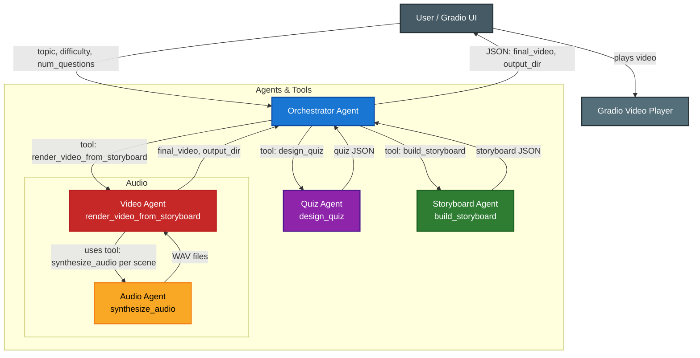

# Architecture Overview

## Component Responsibilities

- **Gradio UI** – Teacher-facing entry point that gathers topic, difficulty, and question count, and renders the final MP4 + storyboard JSON.
- **Orchestrator Agent** – Google ADK root agent that parses the request, chains the downstream tools, handles retries, and emits the strict JSON response consumed by the UI.
- **Quiz Agent** – Uses Gemini 2.5 Flash prompts plus pedagogy instructions to return normalized quiz JSON (`questions`, `choices`, `answers`, metadata).
- **Storyboard Agent** – Translates quiz JSON into timed scenes with `type`, `duration_sec`, `text`, and `voiceover`, ensuring pacing that matches the README workflow.
- **Audio Agent** – Calls Gemini TTS for each scene voiceover, falls back to cached countdown clips or silent WAVs when TTS is unavailable, and writes files under `outputs/audio_cache/`.
- **Video Agent** – Requests narration per scene, renders visuals with MoviePy, muxes audio, and saves the stitched `quiz_video_local.mp4` plus intermediate assets in the run directory.

## Sequential Workflow (mirrors README)

1. **Orchestrator Agent** receives sanitized inputs from the UI and records the request.
2. **Quiz Agent** (`design_quiz`) generates curriculum-aligned multiple-choice questions with difficulty scaling.
3. **Storyboard Agent** (`build_storyboard`) produces scene order, timings, and narration text optimized for attention and retention.
4. **Audio Agent** (`synthesize_audio`) produces WAV narration + timer sounds for each scene.
5. **Video Agent** (`render_video_from_storyboard`) renders slides, synchronizes narration, and returns file paths.
6. **Orchestrator Agent** packages the final JSON payload: topic, difficulty, num_questions, `final_video`, and `output_dir`.

## Tool Integrations

| Agent / Tool | Primary Function | Key Dependencies |
|--------------|-----------------|------------------|
| Quiz Agent · `design_quiz` | Gemini 2.5 Flash prompt engineering with pedagogy guardrails | `quiz_generator_agent.config`, logging |
| Storyboard Agent · `build_storyboard` | Scene sequencing, duration heuristics, narration text | Quiz JSON schema |
| Audio Agent · `synthesize_audio` | Gemini TTS voiceover per scene + countdown cache | `outputs/audio_cache`, silent WAV fallback |
| Video Agent · `render_video_from_storyboard` | MoviePy rendering, audio muxing, file orchestration | `moviepy`, `imageio-ffmpeg`, Audio Agent |
| Orchestrator Agent | Tool chaining, retries, strict JSON formatting | Google ADK orchestrator (`orchestrator_agent.py`) |

## Data Flow & Storage

- **Run directories**: `outputs/<topic_slug>_<timestamp>/` store `quiz.json`, `storyboard.json`, scene audio, and `quiz_video_local.mp4`.
- **Audio cache**: `outputs/audio_cache/` retains reusable countdown clips to avoid redundant synthesis.
- **UI media**: `images/` hosts the screenshots and demo video shown in the README sample output block.
- **Return payload**: UI reads the orchestrator’s JSON response and surfaces summary text, storyboard JSON, and the rendered MP4.

## Observability & Resilience

- Centralized logging via `logging_utils.py` with `LOG_LEVEL` environment override mirrors the README observability section.
- Each agent logs entry parameters; the README sample output corresponds directly to these log statements.
- Audio Agent catches Gemini TTS errors and emits silent WAV backups so the Video Agent never blocks.
- Orchestrator retries failed tool calls per Google ADK semantics and propagates actionable errors back to the UI.
